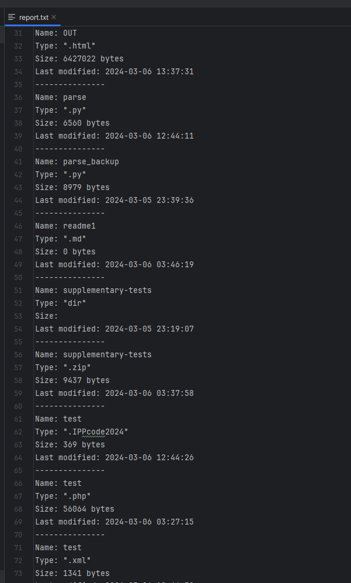
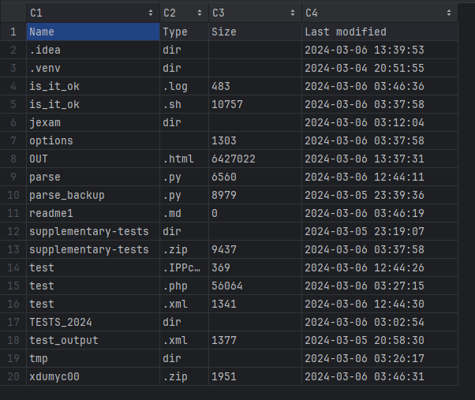

# Homework_1 - FileReporter

The application receives the full path of a directory as an input parameter. It gathers a list of files and folders in that directory, along with 3 properties of each file/folder (type, size, last modification time).

The application generates a report about the contents of the directory. The report is in various .txt, .csv formats.


## Usage

Run the application, providing the desired directory as a command-line argument. For example, if your executable is named app.exe and the directory you want to analyze is C:/Users/username/Documents/, you would enter:

```app.exe "C:/Users/username/Documents/"```

## Reports examples


